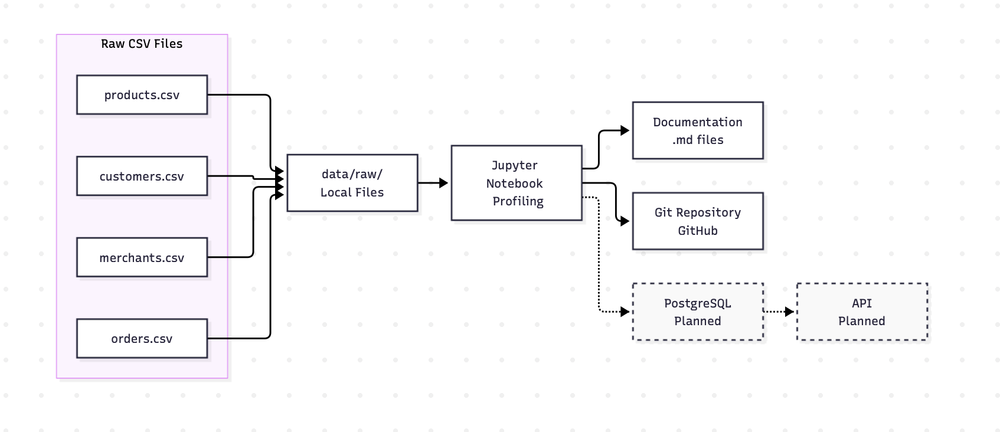

# CityFlow Data Engineering Project

## Предметна область
CityFlow — це сервіс міських замовлень і доставки. Цей проєкт реалізує побудову конвеєра даних для профілювання, обробки, валідації та транзакційного завантаження сирих даних у реляційну базу PostgreSQL.

## Структура проєкту
- `data/raw/` — оригінальні CSV-файли джерел (ігноруються Git).
- `data/sample/` — зразки даних для тестування.
- `docs/` — словник даних, реєстр проблем якості, політика завантаження, архітектурна схема.
- `notebooks/` — Jupyter Notebook з кодом первинного дослідницького аналізу та профілювання.
- `src/` — Python-скрипти для автоматизованого імпорту даних.
- `sql/` — DDL та DML скрипти для створення схем бази даних та трансформації.

## Як запустити
1. Створіть та активуйте віртуальне середовище:
   `python -m venv .venv`
2. Встановіть необхідні залежності:
   `pip install -r requirements.txt`
3. Помістіть вихідні CSV-файли в директорію `data/raw/`
4. Для перегляду аналізу якості даних запустіть `jupyter lab` та відкрийте `notebooks/01_source_profiling.ipynb`.
5. Налаштуйте підключення до бази даних у файлі `src/load_staging.py`.
6. Створіть структуру БД (схеми та таблиці), виконавши DDL-скрипти:
   `psql -d cityflow -f sql/01_schemas_and_stg.sql`
   `psql -d cityflow -f sql/02_core_ddl.sql`
7. Запустіть імпорт сирих даних у проміжну схему Staging:
   `python src/load_staging.py`
8. Виконайте SQL-транзакцію для валідації та завантаження перевірених даних у схему Core:
   `psql -d cityflow -f sql/03_transform_and_load.sql`

## Висновки щодо якості даних
- Вихідні дані містять низку проблем: повні дублікати рядків, відсутні номери телефонів клієнтів, аномальні від'ємні ціни та некоректні формати дат.
- На етапі завантаження зі `stg` в `core` налаштовано автоматичну фільтрацію цих аномалій за допомогою SQL-транзакцій.
- Структура цільової бази суворо відповідає реляційній моделі (забезпечено Constraints, PK та FK).
- Наступним етапом розвитку проєкту є розширене очищення (Data Cleansing) та проєктування аналітичного сховища (DWH).

## Архітектура (v0)
